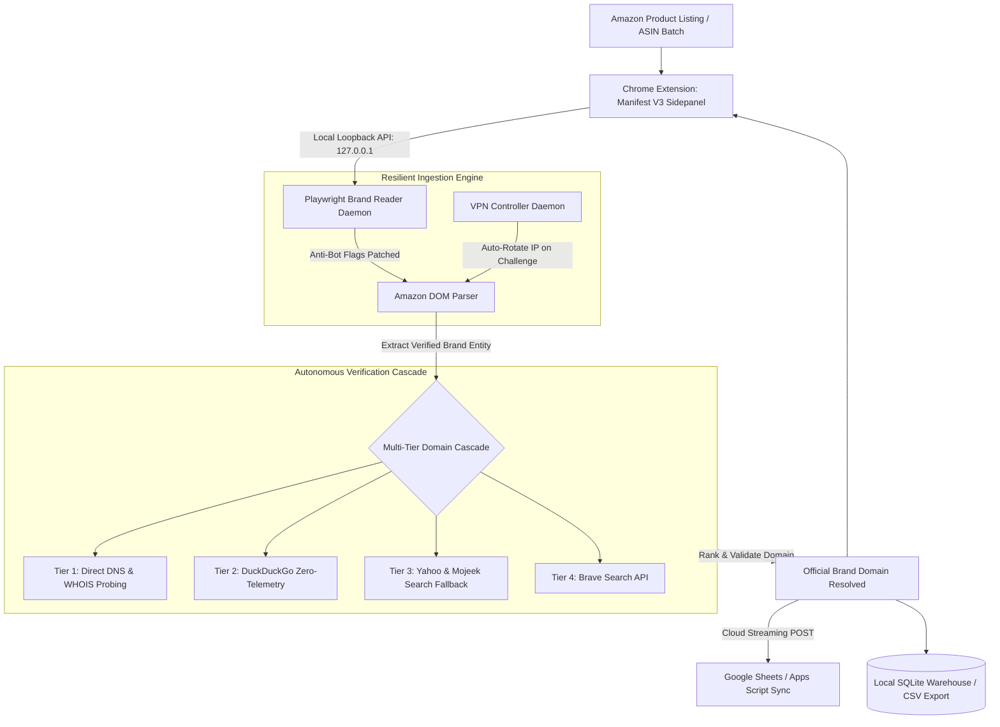

# ⚡ Source Genius — Autonomous Amazon Brand Website Finder

<div align="center">

[](LICENSE)
[](https://developer.chrome.com/docs/extensions/mv3/intro/)
[](https://playwright.dev/)
[](https://github.com/Kamran5H/SourceGenius)
[](https://github.com/Kamran5H/SourceGenius)

**Enterprise-grade Amazon wholesale sourcing pipeline combining a Manifest V3 Chrome Extension, anti-bot Playwright brand reader, automated VPN rotator, and multi-engine DNS discovery cascade.**

[Architecture](#-system-architecture) • [Components](#-core-components) • [Search Cascade](#-multi-tier-website-search-cascade) • [Quickstart](#-quick-start) • [License](#-license)

</div>

---

## 🌟 Executive Overview

**Source Genius** is a full-stack automated intelligence platform built for professional Amazon wholesale distributors, private-label sourcers, and e-commerce aggregators. It automates the tedious manual bottleneck of locating direct manufacturer and brand owner websites from raw Amazon ASINs and product listings.

By orchestrating an anti-detection Chrome sidepanel extension, a local headless browser reader, an automated Windows VPN rotator, and a 6-tier search cascade, Source Genius reliably uncovers official brand domains, wholesale inquiry contact endpoints, and direct supplier relationships at scale.

---

## 🏗️ System Architecture



---

## 🧩 Core Components

### 1. `brand-finder-extension-v7.1.11/` — Manifest V3 Chrome Extension
The primary operator console. Running natively in the Chrome Sidepanel, it provides:
- Live status telemetry, real-time extraction queues, and lead tables
- Automated tab listener extracting ASINs directly as you browse Amazon
- Integrated `watchdog.js` to ensure 24/7 background worker stability
- Direct streaming to Google Sheets via `user-livewrite.gs`

### 2. `brand_reader_v2.py` — Playwright Brand Reader Daemon
A local HTTP daemon running on `127.0.0.1:8766`. It controls an anti-bot patched Chromium instance to fetch and parse Amazon product pages using real browser fingerprints, entirely bypassing CAPTCHA blocks.

### 3. `vpn_controller.py` — Automated Network Rotator
A background sentinel that monitors network health. If Amazon serves a soft block or high latency is detected, the VPN controller automatically switches server nodes via local CLI commands (Mullvad, WireGuard, or OpenVPN) and resumes the pipeline transparently.

### 4. `BrandScrapers/` — Data Pipeline Engine
Batch CSV processing tools, Keepa historical sales velocity integration, and Google Sheets reconciliation utilities for enterprise workloads.

---

## 🔍 Multi-Tier Website Search Cascade

Source Genius validates official brand domains through an intelligent fallback cascade:

| Tier | Engine / Protocol | Characteristics |
| :--- | :--- | :--- |
| **Tier 1** | **Direct DNS Probing** | Tries `[brand].com`, `[brand].co`, `get[brand].com` with MX/A record verification. |
| **Tier 2** | **DuckDuckGo API** | High-precision zero-telemetry search matching brand keywords and trademark entities. |
| **Tier 3** | **Yahoo & Mojeek** | Independent search index fallback avoiding Google rate limits. |
| **Tier 4** | **Brave Search API** | Global privacy-preserving web index for ambiguous or international brand names. |

---

## ⚡ Quick Start

### 1. Clone & Initialize
```bash
git clone https://github.com/Kamran5H/SourceGenius.git
cd SourceGenius

# Setup Python environment
python -m venv .venv
.venv\Scripts\activate

# Install dependencies
pip install playwright requests beautifulsoup4
playwright install chromium
```

### 2. Launch Local Reader
```bash
# Start the local Playwright brand reader
python brand_reader_v2.py
```

### 3. Load Extension in Chrome
1. Navigate to `chrome://extensions/` in Google Chrome.
2. Enable **Developer mode**.
3. Click **Load unpacked** and select the `brand-finder-extension-v7.1.11/` folder.
4. Open the Source Genius Sidepanel and begin sourcing!

---

## 📜 License

This project is open-source and released under the [MIT License](LICENSE).  
Copyright (c) 2024-2026 **Kamran Ashraf**.
